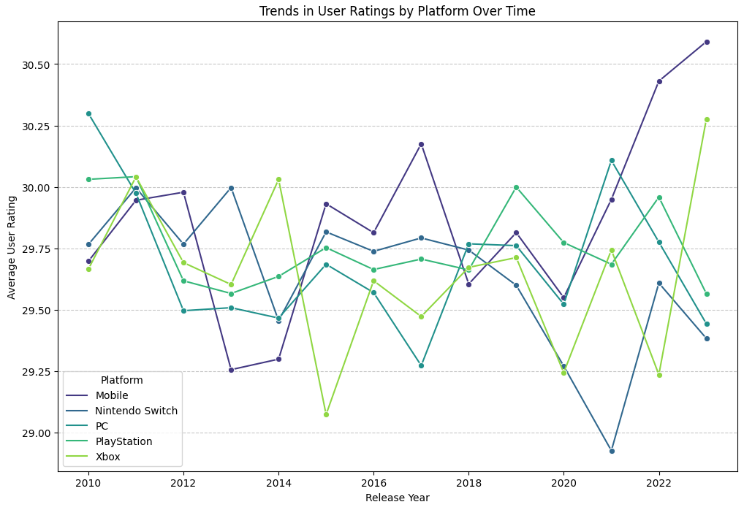

# EDA Project (TovTech) - Video Game reviews

#### by Roman Fesunenko

This EDA project was made within the framework of Data Analyst course by TovTech.
As part of the project, I chose topic of Video Games reviews, because it is one of my favorite topics.
During the project, I was found amazing things in a Data. For example, there have 47774 reviews and there only have 40 video games from last decades.
Also, there have 10 genres: "Action", "Adventure", "Fighting", "Party", "Puzzle", "RPG", "Shooter", "Simulation", "Sports" and "Strategy".
In addition, there have 5 game platforms: "Xbox", "PlayStation", "PC", "Nintendo Switch" and "Mobile".
There have 4 age groups categories as well: "All ages", "Kids", "Teens", "Adults".

*By framework of EDA project, I was researched the next questions:*

- How do user ratings correlate with factors like price or completion time?
- Are there any significant differences in user ratings for games released on different platforms (PC vs. Console vs. Mobile) per year?
- Can we identify any patterns in user reviews based on the age group the game is targeted towards?
- How does the sentiment of user reviews (positive, negative, neutral) differ across different game genres?

*By basic data analysis I have discovered next things:*

- Average price of the video games is 40 USD, minimal price of the video games is 20 USD, maximal price of the video games is 60 USD.
- Average rating of the video games is 30, minimal rating of the video games is 10, maximal rating of the video games is 50.
- TOP-5 popular games are 'Pokemon Skarlet & Violet', 'Minecraft', 'FIFA 24', 'Street Fighter V' and 'Tomb Raider (2013)'
- TOP-5 popular genres are RPG, Shooter, Strategy, Puzzle and Simulation.
- TOP-5 popular platforms are PlayStation, PC, Nintendo Switch, Mobile and Xbox.
- Most reviewed genre in recent years is Strategy. Least reviewed genres in recent years are Sports and RPG.
- Most reviewed platform in recent years is PlayStation. Least reviewed platform in recent years is Xbox.
- Most reviewed age group in recent years is Kids. Least reviewed age group in recent years is Adults.

*By advanced data analysis I have discovered next things:*

- Expensive video games taking to walkthrough the game is more hours than cheaper video games.
- Video games with higher ratings cost expensive than games with lower rating
- Games with higher ratings taking to walkthrough the game is more hours than video games with lower ratings.
- Platform ratings are changing per year that some platform increasing rating and other platforms are decreasing rating.
- It seems that mobile games got higher rating, because games for mobile device that using more in recent years become more popular.
- It seems that 1/4 of reviewers of games of each age group targeted are from different age group and also feel that games that age group targeted are not necessarily appropriate for an age group.
- It seems that 1/4 of reviewers of video games of each genre dissapointed by game experiences in game.
- It seems that most of reviewes of video games of each genre more liked to review their genre.
- Every reviewer have different ratings in every video games.

## Most impressive graph in EDA project:

## How the learning in Datacamp helped me with the project?
Before beginning this project, I was learned Python and Pandas courses in DataCamp.
They gave explation, interactvie practices and introduced projects.
Courses of DataCamp helped me more understand how work statistics, data.
Last course that I learned in DataCamp before I began project is "Exploratory Data Analysis in Python".
This course helped understand more how works EDA and how to make EDA project.

## Links to EDA projects and assets in Kaggle

**EDA Project in Jupyter notebook in Kaggle:**

https://www.kaggle.com/code/superroman19/eda-project-tovtech-video-game-reviews

**Video Games in Dataset in Kaggle:**

https://www.kaggle.com/datasets/jahnavipaliwal/video-game-reviews-and-ratings
