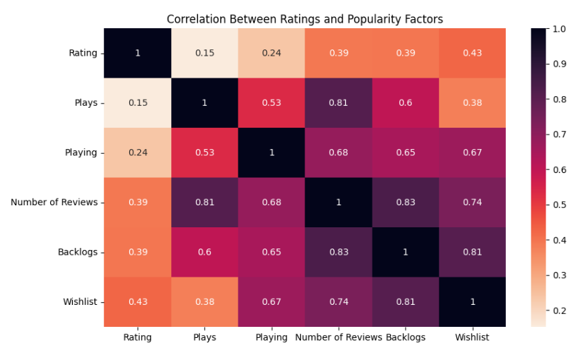
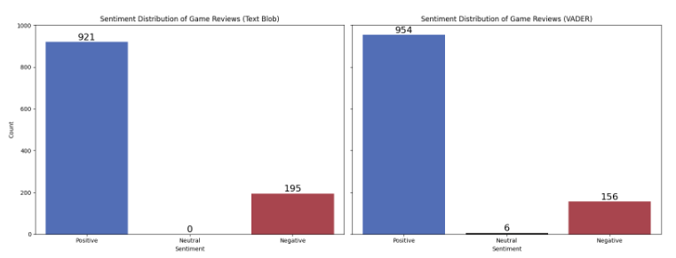

# EDA Project (TovTech) - Video Game reviews

#### by Roman Fesunenko

This EDA project was made within the framework of Data Analyst course by TovTech.
As part of the project, I chose topic of Video Games reviews, because it is one of my favorite topics.
During the project, I was found amazing things in following dataset.

***By framework of EDA project, I was researched the next questions:***

* How do user ratings correlate with factors like popularity or completion time?
* Are there any significant differences in user ratings for games released on different genres per year?
* How does the sentiment of user reviews during reviews of the games?

**Analysis Summary:**

The "Popular Video Games 1980-2023" dataset reveals key trends in game popularity, user reviews, and ratings, providing insights into user preferences, game genres, and the impact of player engagement on a game's success.

**Key Insights:**

* **Top Games:** Minecraft and Grand Theft Auto V are the most popular, highlighting the appeal of sandbox and open-world genres.
* **High-Rated Genres:** RPG and Strategy games receive higher ratings, indicating a preference for depth and complexity.
* **Indie Success:** Indie games like Hades and Undertale are gaining popularity, showing the success of unique gaming experiences from small studios.
* **Multiplayer Demand:** Games like Among Us and Super Smash Bros. Ultimate emphasize the demand for social and competitive gaming.
* **Positive Reviews:** User reviews are mostly positive, with sentiment analysis confirming general satisfaction. Negative reviews, though rare, highlight areas for improvement.
* **Market Growth:** The number of game releases has increased, especially post-2020, though quality varies by year and genre.

**Recommendations:**

* **Immersive Gameplay:** Developers should focus on creating engaging and varied gameplay to cater to a broad audience and ensure high replayability.
* **Community Building:** Emphasize multiplayer features and active player feedback to sustain long-term success.
* **Trend Analysis:** Use wishlist and backlog trends for marketing strategies and player engagement.
* **Franchises and Innovation:** Invest in franchises and sequels for long-term loyalty, while innovating within popular genres to stand out.
* **Regular Updates:** Provide updates, expansions, and in-game events to keep games active and enjoyable over time.

By leveraging player feedback and analyzing user review patterns, developers can stay ahead of industry trends and create games that resonate with their audience.

## Most impressive graphs in EDA project:

## How the learning in Datacamp helped me with the project?

Before beginning this project, I was learned Python and Pandas courses in DataCamp.
They gave explanations, interactive practices and introduced projects.
Courses of DataCamp helped me more understand how work statistics, data.
Last course that I learned in DataCamp before I began project is "Exploratory Data Analysis in Python".
This course helped understand more how works EDA and how to make EDA project.

## Links to EDA projects and assets in Kaggle and DataLab

**Video Games in Dataset in Kaggle:**

https://www.kaggle.com/datasets/arnabchaki/popular-video-games-1980-2023

**EDA Project in Jupyter notebook in Kaggle:**

https://www.kaggle.com/code/superroman19/eda-project-tovtech-video-game-reviews

**EDA Project with SQL in Jupyter notebook in DataLab:**

https://www.datacamp.com/datalab/w/bb2f5df0-ccbd-4970-9cbd-e6ebd04af526

---

*© All rights reserved*
