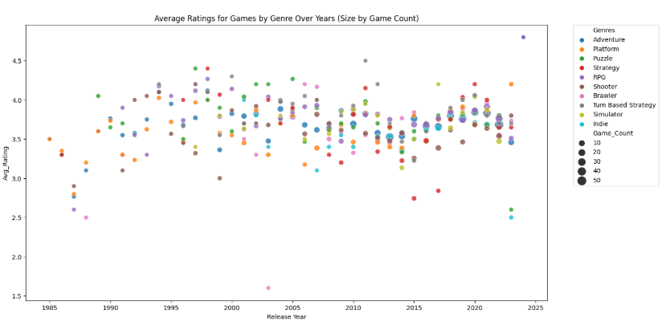
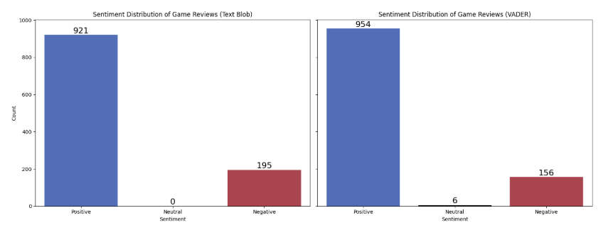

# EDA Project (TovTech) - Video Game reviews

#### by Roman Fesunenko

This EDA project was made within the framework of Data Analyst course by TovTech.
As part of the project, I chose topic of Video Games reviews, because it is one of my favorite topics.
During the project, I was found amazing things in following dataset.

***By framework of EDA project, I was researched the next questions:***

* How do user ratings correlate with factors like popularity or completion time?
* Are there any significant differences in user ratings for games released on different genres per year?
* How does the sentiment of user reviews during reviews of the games?

Through analyzing the "Popular Video Games 1980-2023" dataset, several key trends and insights about video game popularity, user reviews, and ratings have emerged. This analysis not only answered the core questions of how ratings correlate with popularity and completion time but also uncovered deeper patterns about user preferences, game genres, and the role of player engagement in shaping a game’s success.

**Key Insights:**

* Minecraft and Grand Theft Auto V are the most popular games, showcasing the lasting appeal of sandbox and open-world genres.
* RPG and Strategy games consistently receive higher ratings, reflecting the preference for depth and complexity in gameplay.
* Indie games, like Hades and Undertale, are gaining traction, indicating the growing success of small studios offering unique gaming experiences.
* Multiplayer games, such as Among Us and Super Smash Bros. Ultimate, highlight a clear demand for social and competitive experiences in gaming.
* User reviews are overwhelmingly positive, with text sentiment analysis confirming the general satisfaction among players. While neutral reviews are rare, negative sentiment is an important factor in understanding potential areas for improvement.
* The number of games released has been steadily increasing, especially after 2020, highlighting the expanding gaming market. However, the quality of games varies significantly, especially in certain years or genres.

**Recommendations:**

* Game developers should focus on creating immersive gameplay experiences, offering variety in genres to cater to a wider audience and ensuring high replayability to maintain player engagement.
* The importance of community building cannot be overstated, with multiplayer features and active player feedback being key to sustaining long-term success.
* Analyzing trends in wishlists and backlogs offers valuable insights for future marketing strategies and player engagement efforts.
* For developers aiming for sustained success, investing in franchises and sequels can help build long-term loyalty, while being innovative within popular genres will set games apart in an oversaturated market.
* Regular updates, expansions, and in-game events can turn backlogs into active plays, ensuring that games continue to be enjoyed long after their initial release.

By continuously listening to player feedback and analyzing patterns in user reviews and sentiment, developers can stay ahead of industry trends and ensure their games resonate with their audience.

## Most impressive graphs in EDA project:

## How the learning in Datacamp helped me with the project?

Before beginning this project, I was learned Python and Pandas courses in DataCamp.
They gave explation, interactvie practices and introduced projects.
Courses of DataCamp helped me more understand how work statistics, data.
Last course that I learned in DataCamp before I began project is "Exploratory Data Analysis in Python".
This course helped understand more how works EDA and how to make EDA project.

## Links to EDA projects and assets in Kaggle and Datalab

**Video Games in Dataset in Kaggle:**

https://www.kaggle.com/datasets/arnabchaki/popular-video-games-1980-2023

**EDA Project in Jupyter notebook in Kaggle:**

https://www.kaggle.com/code/superroman19/eda-project-tovtech-video-game-reviews

**EDA Project with SQL in Jupyter notebook in Datalab:**

https://www.datacamp.com/datalab/w/bb2f5df0-ccbd-4970-9cbd-e6ebd04af526

---

*© All rights reserved*
